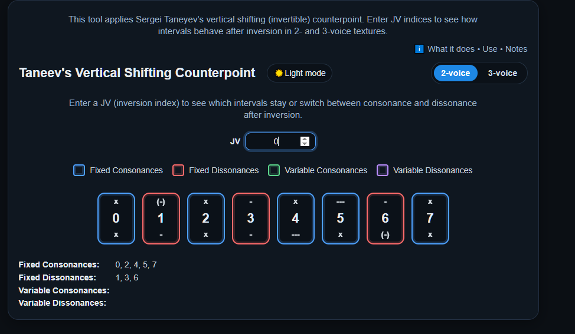
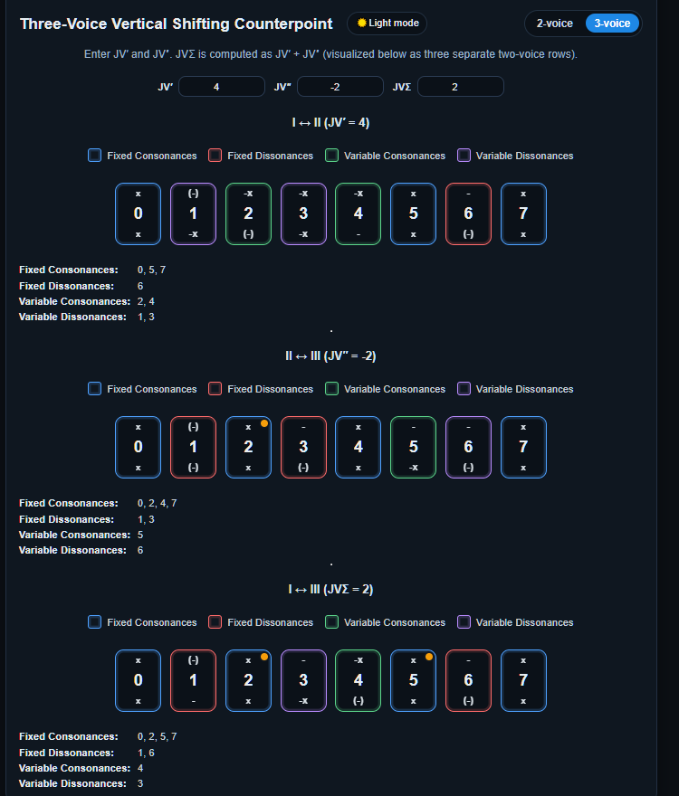

# 🎼 Taneyev's Vertical Shifting Counterpoint Tool

This interactive web tool applies Sergei Taneyev’s concept of **vertical shifting (invertible) counterpoint**.  
By entering inversion indices (JV values), you can see how musical intervals behave after inversion in both **2-voice** and **3-voice** textures.

👉 Try it out to explore which intervals stay consonant/dissonant, and which switch category after inversion.

---

## 🚀 Features
- Explore **2-voice** and **3-voice** counterpoint inversion.
- Visual grid showing **Fixed Consonances, Fixed Dissonances, Variable Consonances, Variable Dissonances**.
- Works with any JV index (positive or negative).
- Dark and Light modes for easy reading.

---

## 📖 How to Use

### 🔹 2-Voice Counterpoint

In 2-voice mode, enter a **JV (inversion index)** to see how intervals behave after inversion.

- **Fixed Consonances** (blue) – intervals that always remain consonant.
- **Fixed Dissonances** (red) – intervals that always remain dissonant.
- **Variable Consonances** (green) – intervals that may change.
- **Variable Dissonances** (purple) – intervals that may change.

Example (JV = 0):  

Example (JV = –2):  

At the bottom, the tool also lists which intervals fall into each category.

---

### 🔹 3-Voice Counterpoint

In 3-voice mode, you enter **two JV values (JV′ and JV″)**.  
A third value (JVΣ) is automatically computed as the sum of the first two.  
The tool then shows three separate **2-voice comparisons**:

- I ⇔ II (JV′)
- II ⇔ III (JV″)
- I ⇔ III (JVΣ)

Each comparison displays the same consonance/dissonance categories as in 2-voice mode.

Example (JV′ = 4, JV″ = –2):  

This way, you can study how **interval relations across three voices** behave after inversion.

---

## 📌 Notes
- This tool is meant for **theoretical study and teaching** of Taneyev’s counterpoint system.
- It doesn’t generate music, but instead provides a **visual framework** for interval transformations.
- Great for exploring how consonance/dissonance balance shifts in multi-voice textures.

---

## 🛠️ Development
Built with:
- **Angular** (frontend UI)
- **Spring Boot / Java** (backend services for interval logic)

---

## 📜 License
MIT License
